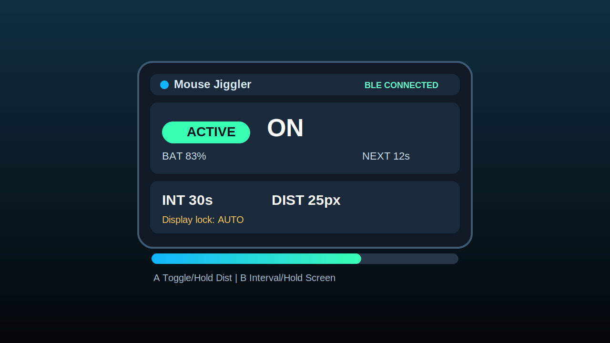
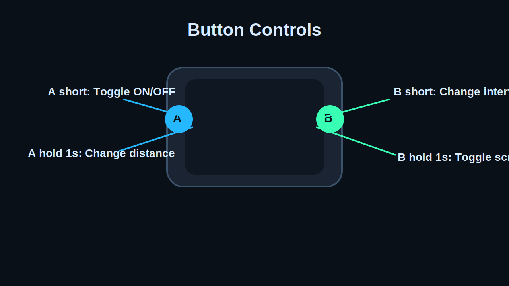

# M5StickC Plus Bluetooth Mouse Jiggler

This project turns an M5StickC Plus into a Bluetooth mouse jiggler using the ESP32 BLE Mouse library.
It prevents your computer from going idle by sending subtle periodic mouse movement.

## UI Preview

Main dashboard:

Button controls:

## Features

- BtnA short press: toggle jiggle ON/OFF
- BtnA long press (>1s): cycle jiggle distance (5/10/25/50 px)
- BtnB short press: cycle jiggle interval (5s/15s/30s/60s/5m/10m)
- BtnB long press (>1s): toggle display lock (always-on vs auto-sleep)
- Settings persistence (interval + distance survive reboot)
- Non-blocking jiggle motion loop
- Graphic UI with cards, icons, status badge, countdown, and progress capsule
- BLE connection state + battery percentage on screen

## Hardware

- M5StickC Plus
- USB-C cable

## Software

- Arduino IDE / PlatformIO / arduino-cli
- `M5StickCPlus`
- `ESP32 BLE Mouse` (dev branch): https://github.com/sirfragles/ESP32-BLE-Mouse/tree/dev

## Usage

1. Flash firmware to the device.
2. Pair with your computer as a Bluetooth mouse.
3. Use controls:
   - `BtnA`: toggle ON/OFF
   - `Hold BtnA`: distance
   - `BtnB`: interval
   - `Hold BtnB`: display lock mode

## License Compliance

- Project source in this repository is licensed under MIT.
- Third-party libraries keep their original licenses and are not relicensed by this repository.
- UI preview images in `assets/ui/*.svg` are original artwork created for this repo and released under MIT with the project.
- Brand and library names remain the property of their respective owners.
- Verify downstream redistribution requirements for all included dependencies in your own release pipeline.

## License

MIT License.
